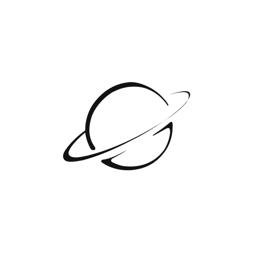
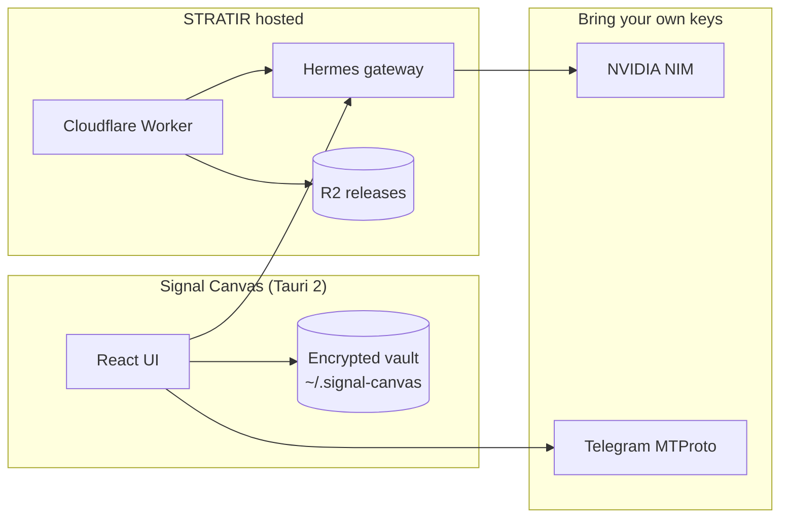

<p align="center">
  
</p>

<h1 align="center">Signal Canvas</h1>

<p align="center">
  <strong>macOS investigation console for institutional digital protection review.</strong><br/>
  Human-in-the-loop. Encrypted on disk. Agent-assisted. Built for NGOs and CSOs.
</p>

<p align="center">
  <a href="https://signal-canvas.tethsiga.workers.dev/download">Download macOS (Apple Silicon)</a>
  ·
  <a href="https://signal-canvas.tethsiga.workers.dev/">Landing page</a>
  ·
  <a href="LICENSE">MIT License</a>
</p>

<p align="center">
  
  
  
  
</p>

---

An **open source product of [Stratir.com Applied AI Studio](https://stratir.com)**. Signal Canvas is a native macOS desk where trained analysts monitor Telegram sources, map actors on an investigation graph, collaborate with a Hermes session agent, and export institutional review memoranda — without automated enforcement or unsupervised contact with subjects.

> **macOS only (v0.1.0).** Bring your own NVIDIA, Telegram, and optional Stripe credentials. Cases and sessions stay encrypted on your machine.

## Why Signal Canvas

Most tools in this space sit at two extremes: consumer parental apps, or heavy law-enforcement systems. NGOs and CSOs need something in the middle — structured OSINT review, audit trails, escalation-ready briefs, and an agent layer that **augments** analysts rather than replacing judgment.

Signal Canvas is that operational layer.

## What you can do

| Capability | Description |
|------------|-------------|
| **Encrypted case vault** | Per-case sessions, graph, chat, and audit log persisted locally with passcode-derived encryption |
| **Telegram MTProto monitoring** | Join chats, stream flagged messages, map signals to the graph |
| **Investigation graph** | STRATIR native link chart or orbit-style investigation layout |
| **Hermes Session Agent** | Conversational desk agent plus `/scan`, `/correlate`, and brief workflows |
| **NVIDIA NIM** | BYOK reasoning via Nemotron (Settings → NVIDIA) |
| **Institutional brief + PDF** | Polished memorandum for partner handoff — filters operational noise (login codes, system messages) |
| **Stripe treasury (optional)** | Hackathon earn/spend loop for funded case workflows |

## Architecture



## Download

**Production build (signed + notarized, Apple Silicon):**

👉 **[Download Signal Canvas](https://signal-canvas.tethsiga.workers.dev/download)**

After install: create an operator account, add keys in **Settings**, open a case, connect Telegram, and start monitoring.

## Quick start (development)

```bash
git clone https://github.com/AXRoux/signal-canvas.git
cd signal-canvas
npm install

# Optional: local Hermes gateway
npm run setup:integrations
hermes gateway   # terminal 1

npm run tauri dev   # terminal 2
```

Production build:

```bash
npm run tauri build
# → src-tauri/target/release/bundle/macos/Signal Canvas.app
```

Deploy macOS release to R2 + download worker:

```bash
npm run deploy:release
```

Requires `.env.apple` (see `.env.apple.example`) and `wrangler login`.

## Hackathon stack

| Layer | Technology |
|-------|------------|
| Desktop shell | [Tauri 2](https://v2.tauri.app/) + Rust |
| UI | React 19, Vite, Tailwind, [@xyflow/react](https://reactflow.dev/) |
| Agent | [Hermes Agent](https://github.com/NousResearch/hermes-agent) · hosted on Cloudflare Workers |
| Models | NVIDIA NIM / Nemotron (BYOK `nvapi-...`) |
| Payments | Stripe Link CLI + Projects skills (optional) |
| Releases | Cloudflare R2 + Workers |

Details: [integrations/README.md](integrations/README.md)

## Security

Signal Canvas is **open source with zero secrets in git**. Operator credentials, case data, and Telegram sessions never belong in this repository.

| Data | Storage |
|------|---------|
| API keys (NVIDIA, Nous, Stripe, Telegram) | Encrypted `~/.signal-canvas/integrations.json` |
| Cases & graph | Encrypted `~/.signal-canvas/workspace.db` + `data-key.enc` |
| Operator accounts | `~/.signal-canvas/auth.json` (local only) |
| Telegram sessions | `~/.signal-canvas/telegram/` (gitignored) |
| Worker secrets | `wrangler secret put` on Cloudflare |

**Before every push:**

```bash
npm run security:check
```

**If keys were exposed** (chat, screenshot, accidental commit):

```bash
npm run security:reset-secrets
# Then rotate keys at NVIDIA, Nous, Stripe, Telegram, and Apple
```

Full policy: **[SECURITY.md](SECURITY.md)**

### Responsible disclosure

If you discover a security issue, please report it privately to the STRATIR maintainers before filing a public issue with exploit details.

## Project layout

```
signal-canvas/
├── src/                 # React UI, stores, graph, brief/PDF
├── src-tauri/           # Rust: vault, Hermes client, Telegram bridge
├── cloudflare/          # Download page, Hermes gateway worker, R2
├── scripts/             # Release deploy, integration setup, secret scan
├── docs/                # Product vision, demo flow, design notes
└── .hermes/skills/      # signal-canvas-scan, correlate, brief
```

## Documentation

- [Product vision](docs/01-product-vision.md)
- [Demo flow](docs/03-demo-flow.md)
- [UI design](docs/02-ui-design.md)
- [Integrations](integrations/README.md)
- [Security policy](SECURITY.md)

## Disclaimer

Signal Canvas is an **institutional review tool**. It does not constitute legal advice, automated enforcement, or permission to contact investigation subjects. All findings require human verification against primary sources before external distribution or escalation.

## License

MIT © [STRATIR](https://stratir.com). See [LICENSE](LICENSE).

---

<p align="center">
  <sub>Signal Canvas · Stratir.com Applied AI Studio · Hermes × NVIDIA × Stripe hackathon build</sub>
</p>
